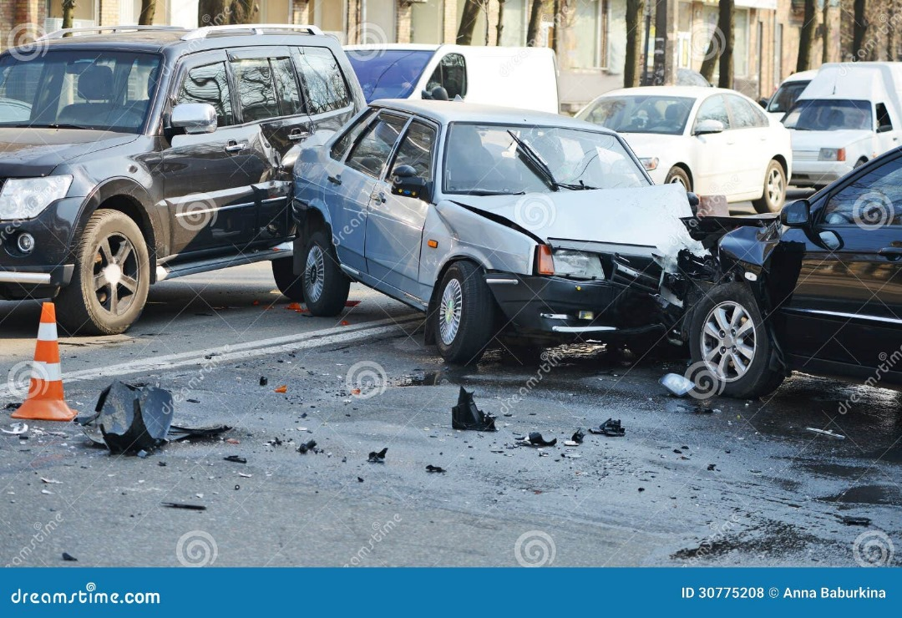
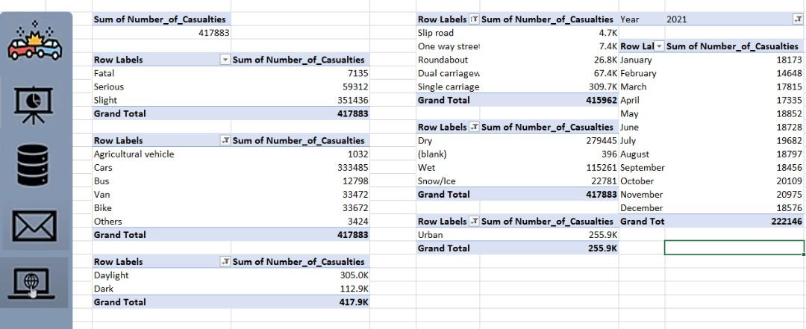
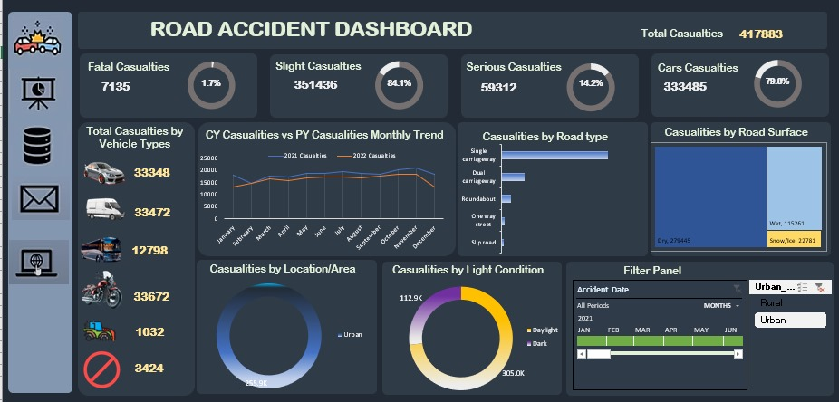

# ROAD-ACCIDENT-ANALYSIS
 
## Introduction
This is an Excel project on road accident using data for the years 2021 and 2022. Road safety is a significant concern impacting communities worldwide. 
In response to this issue, I have developed a Road Accident Analytics Dashboard. 
The dashboard provides stakeholders with critical insights, enabling them to make informed, data-driven decisions to enhance road safety.

Disclaimer : **All datasets and reports do not represent any company, institution or country, but just a dummy datasets to demonstrate capabilities of Excel.**
##  Problem Statement
Despite ongoing efforts to improve road safety, road traffic accidents remain a significant public concern, resulting in over 417,000 casualties within the reporting period. A majority of these are slight injuries (84.1%), but a substantial number also result in serious (14.2%) and fatal injuries (1.7%).
Key contributing factors include:
* Vehicle Types: Cars and motorcycles account for a high proportion of accidents.
* Environmental Conditions: A large number of accidents occur on wet road surfaces and during daylight hours.
* Geographic Distribution: The majority of incidents happen in urban areas.
* Road and Light Conditions: Certain road types (e.g., single carriageways) and poor lighting are associated with higher accident rates.

## Skills/ concepts demonstrated:
The following Excel features were incorporated:
Based on the Road Accident Dashboard, the following **skills and concepts** are demonstrated:

### **Skills / Concepts Demonstrated**
1. **Data Visualization**
   * Use of various chart types (e.g., pie charts, bar graphs, line charts) to represent complex data in an understandable format.
   * Effective use of color coding and layout for clarity and quick insights.
2. **Data Analysis & Interpretation**
   * Categorizing data by severity, vehicle type, road condition, and time trends to identify key patterns.
   * Comparison of current year vs. previous year to understand trends over time.
3. **Dashboard Design & Development**
   * Designing a user-friendly and interactive dashboard interface.
   * Implementing filters (e.g., by location and time) for dynamic data exploration.
4. **Problem Identification**
   * Highlighting key risk factors contributing to road accidents (e.g., urban areas, wet surfaces, specific vehicle types).
   * Differentiating between slight, serious, and fatal casualties for prioritization.
5. **Use of KPIs (Key Performance Indicators)**
   * Displaying total casualties and percentage breakdowns for quick performance tracking.
6. **Geographical and Environmental Contextualization**
   * Analysis of how location (urban/rural), road type, light, and weather conditions impact accidents.
7. **Communication of Insights**
   * Presenting insights visually to support data-driven decision-making by stakeholders like transport agencies, urban planners, and safety regulators.
  
## Stakaeholders
1. Ministry of transport
2. Road Transport Department
3. Police Force
4. Emergency Service Department
5. Road safety corps
6. Transport Operators
7. Traffic Management Agencies
8. Public
9. Media

## Metadata
* File Extension: .xlsx
* Number of Rows: 307,974
* Number of Fields: 23
* Title: Road Accident Dashboard
* Subject: Visualization and analysis of road traffic accident data
* Total Records Analyzed: 417,883 casualties
* Data Source: Likely from national or regional road safety and transportation authorities (e.g., Department for Transport or similar)
* Reporting Period: Includes a comparative analysis of two years (e.g., 2021 and 2022)
* Geographic Scope: Urban and rural areas (exact location unspecified)
* Data Dimensions:
  * Casualty Severity: Fatal, Serious, Slight
  * Vehicle Type: Cars, vans, motorcycles, buses/coaches, bicycles
  * Road Type: Single carriageway, dual carriageway, roundabout, etc.
  * Road Surface Condition: Dry, Wet, Snow/Ice
  * Light Condition: Daylight, Dark
  * Location Type: Urban vs. Rural
* Time: Monthly trend comparison (CY vs PY)
* Visualization Tool Used: Created using MS Excel
* Purpose: To provide a comprehensive overview of accident patterns and support data-driven decision-making for road safety improvement
* Target Audience: Government agencies, planners, law enforcement, public health, researchers, and the general public

## Data Analysis

To streamline the interpretation of the road accident dataset and facilitate ease of use for new users, developers, or clients, a dedicated "Data Analysis" sheet was created. 
This sheet consolidates key insights using nine pivot tables, each focusing on a specific relationship within the dataset and highlight trends, 
focusing on the relationship between the number of casualties and various factors such as casualty type, vehicle type, road type, and location.
Monthly trends for the years 2021 and 2022 were also analyzed.

Below is a snippet of the Data Analysis Sheet.

## Visualization:
Finally, the dashboard was created by inserting and customizing pivot charts based on the corresponding pivot tables. 
To ensure a user-friendly and interactive experience, slicers and timelines were incorporated. 
Hyperlinks and connections were also added to relevant icons for seamless navigation.

Below is a snippet of the final dashboard in Excel.
## Key Insight
📉 Total Casualties Analysis: The dashboard shows a significant total of 417,883 casualties resulting from accidents over a two-year period. 

🗓️ Peak Months:The number of casualties was slightly higher in 2021 compared to 2022. The highest number of casualties occurred in October and November for both years, while January and February saw the fewest casualties.

🚗 Casualties by Vehicle Type: Car accidents were responsible for the majority of casualties, making up 79.8% of the total. Accidents involving other vehicle types resulted in minimal 
  casualties.

🩸 Casualties by accident severity: Most casualties (84.1%) were of slight severity, with fatal severity casualties accounting for only 1.7%.

🚚 Road Type Analysis: Single carriageway roads had the highest number of casualties (310,100), whereas slip roads had the fewest (5,100).

⛈️ Casualties Distribution by Road Surface: The majority of casualties (67%) occurred on dry road surfaces.

📖 Casualties Relation by Area/Location: Urban areas accounted for 61% of the casualties following accidents.

🔦 Casualties Distribution by light condition: Most casualties (73%) happened during daylight conditions.

## Recommendations
The dashboard’s comparison of casualty trends between the current and previous years on a monthly basis highlights October and November as critical periods. During these high-risk months, the traffic police and other stakeholders must intensify their road safety measures.
Car drivers account for the majority of casualties To address this, targeted awareness campaigns, strict monitoring, and periodic check-ups on safe driving practices are essential.
Enhanced safety measures are necessary on single carriageway roads, and these roads should be upgraded to double lanes wherever feasible.
By analyzing casualty distribution across different road surface conditions, the dashboard helps identify areas where road maintenance and surface improvements are crucial.
Urban areas require focused interventions to improve road safety, particularly during daytime.

## Conclusion
The Road Accident Analytics Dashboard facilitates data-driven decision-making, empowering stakeholders to implement evidence-based interventions that enhance road safety. 
It serves as a valuable tool for policymakers, traffic authorities, and safety advocates.

Thank you for your interest and time. Your valuable suggestions are welcome. Feel free to connect with me for further discussion. [here](https://www.linkedin.com/in/nzubechukwu-nwafor-pmb-acihrm-58ba80201)

 
